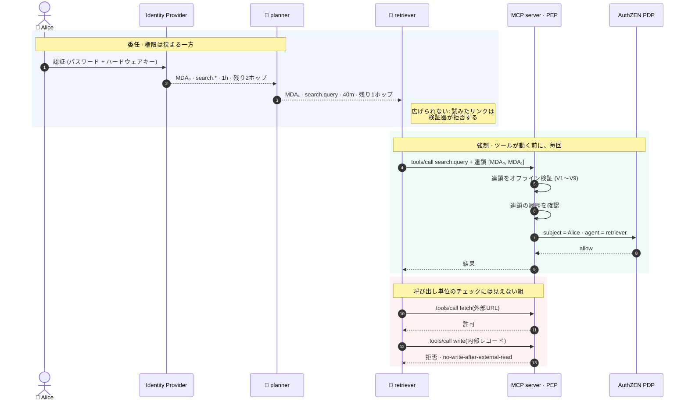

# Mandatum

[English](README.md) | **日本語**

> この文書は翻訳です。**英語版が正典**であり、内容が食い違う場合は [README.md](README.md) が正しいものとします。翻訳方針は [docs/i18n.md](docs/i18n.md) を参照してください。

**AI エージェントのための検証可能な委任。** エージェントが行為する権限を、実在する人間を根とする署名済みの連鎖として表現します。連鎖は一段ごとに権限が狭まり、任意のリンク単位で失効でき、単発の呼び出しではなく行動の並び全体に対して評価され、改竄検知可能なログに記録されます。

> **ステータス: 初期。** フォーマット、検証器、署名層、発行器は一通り動き、実際の署名に対してテストされています。AuthZEN バインディングと並び評価も動きます。監査ログは未実装、並び状態のストアはプロセス内のみ、第三者によるセキュリティレビューも受けていません。それが実務上どういう意味かは [ROADMAP.md](ROADMAP.md) と[脅威モデル](docs/security/threat-model.md)（英語）にあります。
>
> 読んで議論すべき対象は仕様です: [`docs/spec/delegation-assertion.ja.md`](docs/spec/delegation-assertion.ja.md)。

---

## 解こうとしている問題

人間の代わりに行為する AI エージェントは、ほぼ例外なく**クレデンシャルを継承する**ことでそれを実現しています。サービスアカウント、API キー、共有トークン、あるいは人間自身のセッション。ここから3つの失敗が直接導かれます。

**誰の責任か言えない。** エージェントの行動を全環境で人間またはシステムまで確実に追跡できる組織は 28% です（[1](#参考文献)）。また 68% は AI エージェントの活動と人間の活動を明確に区別できません（[2](#参考文献)）。

**エージェント1つだけを失効できない。** エージェントは継承したクレデンシャルを共有しているため、問題を起こしたエージェントを遮断すると、それを使っている他のすべても道連れになります。だから誰もそのレバーを引かず、結果としてエージェントはアクセス権を持ち続けます。

**並びを制約できない。** 認可は1呼び出しずつ判定されます。エージェントが信頼できない外部コンテンツを読み、その後に内部システムへ書き込む。どちらの呼び出しも正当に認可されています。その**組**が情報漏洩であり、呼び出し単位のチェックには原理的に見えません。

Model Context Protocol の認可仕様が扱うのはトランスポート、つまりクライアントがサーバ向けのトークンをどう得るかです。そのトークンがどのツールを呼べるか、どのエージェントが持っているか、誰が誰に委任したかについては何も述べていません。そして MCP の認可 interest group では、ツール単位のスコープとエージェントの連鎖をまたぐ同意についての作業が進行中です。2026年6月に stable となった Enterprise-Managed Authorization 拡張はエンタープライズの identity assertion からアクセストークンを得るものであり、その産物は呼び出しではなくサーバ単位です。

Mandatum が埋めるのはその隙間です。それ以外はやりません。

## 動きかた



3 が残りすべてを成り立たせている性質です。すべてのリンクが親をハッシュでコミットし、狭める方向にしか動けないので、下りながら権限が増えることはありません。`MDA₁` を失効させると agent B は、自分が下位に委任したものも含めてすべてを失います。agent A と兄弟の連鎖は影響を受けません。

12 が他のどこもやっていないものです。どちらの呼び出しも個別には認可されています。その組が情報漏洩であり、1呼び出しずつ見るチェックには判別できません。

## 3つの使いどころ

**Pull Request を開けるコーディングエージェント。** 依存パッケージの README、issue コメント、フォークからの diff を読みます。どれも攻撃者が書き込めます。そのあと push します。読み取りに `external-content`、push に `mutating` のタグを付ければ、前者のあとで後者が止まります。

```json
{ "id": "no-push-after-third-party-read",
  "forbid": { "resource.tags": ["mutating"] },
  "after":  { "resource.tags": ["external-content"] } }
```

**返金を発行できるサポートエージェント。** 顧客のメッセージは攻撃者が制御できるテキストで、返金ツールは金を動かします。形は同じで、スポンサーはそのセッションを承認したエンジニアなので、監査記録には `svc-support-bot` ではなく人間の名前が載ります。

**動かしっぱなしにされた調査エージェント。** スポンサー付与の `max_invocations` が連鎖全体を上限で止めます。状態は連鎖の根で鍵付けされているので、子エージェントを10個生やしても消費するのは同じ予算1つです。

これらのどれにも新しいポリシーエンジンは要りません。必要なのは、ツール呼び出しが「同じ権限のもとで先に何が起きたか」を知っていることです。

## これは何ではないか

この領域のプロジェクトが陥る失敗は、すでに埋まっているカテゴリへ流されていくことです。Mandatum は設計上そこに立ち入りません。

- **認可エンジンではない。** Mandatum は判定を一切しません。事実を確立し、既存の Policy Decision Point に渡すだけです。OPA、Cedar、OpenFGA、SpiceDB、Cerbos、あるいは OpenID AuthZEN Authorization API に準拠した任意の実装。エンジンは隙間ではありません。
- **新しいプロトコルではない。** アサーションは JOSE、発行は RFC 8693、ワークロード識別は SPIFFE、判定は AuthZEN、ログは RFC 6962。既存標準が合う場所では、それをそのまま使います。
- **ゲートウェイ・レジストリ・サンドボックス・エージェントランタイムではない。** それらのカテゴリは混雑しています。Mandatum はライブラリとミドルウェアであり、agentgateway や ToolHive、MCP サーバの**内側で**動くことを意図しています。
- **ブロックチェーンではない。** 監査ログは Merkle ツリーです。合意形成もネットワークもトークンもありません。

## 先行研究について正直に

発行者に問い合わせずに委任できる減衰可能なケーパビリティは macaroons、そして現代的な形では Biscuit の貢献です。ワークロード識別は SPIFFE が確立しました。トークン交換における委任のセマンティクスは RFC 8693 が定め、同時にこのプロジェクトがその外側に位置する線を引きました。§4.1 はリソースサーバに、現在のアクターを認可し過去のアクターは参考情報として扱うよう求めています。Mandatum は履歴に基づいて認可しますが、`act` を読み替えるのではなく独自の検証可能なクレデンシャルでそれを行います。これは RFC 8693 モデルの解釈ではなく拡張であり、[`docs/alternatives.md`](docs/alternatives.md)（英語）に詳しく書いています。

新しいのは狭い3点だけです。任意の再委任を経ても生き残る**認証済み人間を根とする連鎖**、単発ではなく**行動の並びに対して評価される制約**、そして連鎖が特定ベンダーのエンジンではなく任意の準拠エンジンへの入力になる **AuthZEN へのバインディング**。

この3つを既に満たすものが存在するなら、これ以上作る前に知る価値があります。[`docs/alternatives.md`](docs/alternatives.md) を見た上で issue を立ててください。

## ドキュメント

| ドキュメント | 内容 |
| --- | --- |
| [Delegation Assertion 仕様](docs/spec/delegation-assertion.ja.md) | フォーマット、減衰規則、連鎖検証、AuthZEN バインディング、並び評価、脅威モデル |
| [`docs/alternatives.md`](docs/alternatives.md) | 他に何が存在し、なぜこの隙間を埋めないのか（英語） |
| [ROADMAP.md](ROADMAP.md) | 2つのトラックとゲート（英語） |
| [GOVERNANCE.md](GOVERNANCE.md) | ロール、投票、組織バランス（英語） |
| [VERSIONING.md](VERSIONING.md) | セマンティックバージョニング、ワイヤフォーマットのバージョニング、非推奨化（英語） |
| [CONTRIBUTING.md](CONTRIBUTING.md) | 変更をマージするまで（英語） |
| [CHANGELOG.md](CHANGELOG.md) | 各リリースの変更点と既知の限界（英語） |
| [SECURITY.md](SECURITY.md) | 脆弱性の報告（英語） |
| [脅威モデル](docs/security/threat-model.md) | 何を、誰から守るのか。何を前提にしているか。まだ守れていないもの（英語） |
| [サプライチェーン](docs/security/supply-chain.md) | リリースの検証方法、CI が強制していること、既知の穴（英語） |

## 試す

人間がエージェントに委任し、そのエージェントがより狭い権限を再委任し、リソースサーバが届いたものを検証し、権限を広げようとする試みが拒否される — その全体が実行可能な例になっています。

```bash
go test -run Example ./pkg/issue/ -v
```

ソースは [`pkg/issue/example_test.go`](pkg/issue/example_test.go) で、このライブラリが何をするのかについて最も短く正直な説明です。

## コントリビュート

いま最も有用な貢献はコードではありません。エージェントシステムを本番で運用した経験のある人からの設計への反対意見、あるいは仕様で表現できなかった具体的なシナリオです。仕様には[本当に未解決な問い](docs/spec/delegation-assertion.ja.md#12-未解決の問い)を並べたセクションがあります。

Issue と Pull Request は日本語で書いても構いません。ただしコミットメッセージ、コード中のコメント、そして `docs/spec/` への変更は英語でお願いします。仕様は正典が1つでなければならないためです。

詳細は [CONTRIBUTING.md](CONTRIBUTING.md) を参照してください。

## ライセンス

[Apache License 2.0](LICENSE)

---

## 参考文献

1. Cloud Security Alliance and Strata Identity, *Securing Autonomous AI Agents*, 2026年2月 (n=285)
2. Cloud Security Alliance and Aembit, *Identity and Access Gaps in the Age of Autonomous AI*, 2026年3月 (n=228)

---

*translated-from: sha-256:493c0246c719888f9fb9c8c7435537df6e9b90aba198dea899dede776d10fff1*
