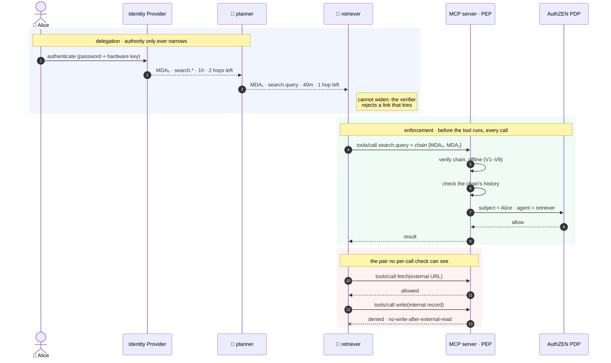

# Mandatum

[](https://github.com/kanywst/mandatum/actions/workflows/ci.yml) [](https://github.com/kanywst/mandatum/actions/workflows/security.yml) [](https://github.com/kanywst/mandatum/actions/workflows/licenses.yml) [](https://scorecard.dev/viewer/?uri=github.com/kanywst/mandatum) [](https://pkg.go.dev/github.com/kanywst/mandatum) [](LICENSE)

**English** | [日本語](README.ja.md)

**Verifiable delegation for AI agents.** An agent's authority to act becomes a signed chain rooted in a named human — attenuating at every hop, revocable at any link, evaluated across whole action sequences, and recorded in a tamper-evident log.

> **Status: early.** The format, the verifier, the signing layer and the issuer work end to end and are tested against real signatures. The AuthZEN binding and sequence evaluation work too. The audit log is not built, the sequence store is in-process only, and nothing here has had a third-party security review. See [ROADMAP.md](ROADMAP.md) and the [threat model](docs/security/threat-model.md) for what that means in practice.
>
> The specification is the thing to read and argue with: [`docs/spec/delegation-assertion.md`](docs/spec/delegation-assertion.md).

---

## The problem

An AI agent acting for a person almost always does so by inheriting a credential — a service account, an API key, a shared token, the human's own session. Three failures follow from that.

**You cannot say who is responsible.** 28% of organizations can reliably trace agent actions to a human or system across all environments ([1](#references)), and 68% cannot clearly distinguish AI agent activity from human activity ([2](#references)).

**You cannot revoke one agent.** Agents share the credential they inherited, so cutting off a misbehaving agent cuts off everything else using it. Nobody pulls that lever, so the agent keeps its access.

**You cannot constrain a sequence.** Authorization is decided one call at a time. An agent reads untrusted external content, then writes to an internal system. Both calls are legitimately authorized. The pair is an exfiltration, and no per-call check can see it.

The Model Context Protocol's authorization specification covers the transport — how a client gets a token for a server. It says nothing about which tool that token may call, which agent holds it, or who delegated to whom, and MCP's authorization interest group has open work on per-tool scopes and on consent across chains of agents. The Enterprise-Managed Authorization extension, stable since June 2026, gets an access token from an enterprise identity assertion, so what it produces is scoped to a server, not to a call.

That gap is what Mandatum fills. Nothing else.

## How it works



Step 3 is the property that makes the rest work: every link commits to its parent by hash and may only narrow, so authority cannot grow on the way down. Revoke `MDA₁` and agent B loses everything, including whatever it delegated onward. Agent A and every sibling chain are untouched.

Step 12 is the one nothing else does. Both calls are individually authorized. The pair is the exfiltration, and a check that sees one call at a time cannot tell.

## Three places this fits

**A coding agent that can open pull requests.** It reads a dependency's README, an issue comment, a diff from a fork: all attacker-writable. Then it pushes. Tag the reads `external-content` and the push `mutating`, and the second one stops after the first.

```json
{ "id": "no-push-after-third-party-read",
  "forbid": { "resource.tags": ["mutating"] },
  "after":  { "resource.tags": ["external-content"] } }
```

**A support agent that can issue credits.** The customer's message is attacker-controlled text and the refund tool moves money. Same shape, and the sponsor is the engineer who approved the session, so the audit record names a person rather than `svc-support-bot`.

**A research agent someone left running.** `max_invocations` on the sponsor's grant caps the whole chain. Because state is keyed by the chain root, spawning ten sub-agents spends the same budget rather than ten of them.

None of these need a new policy engine. They need the tool call to know what happened earlier under the same authority.

## What this is not

The failure mode for a project in this space is drifting into categories that are already occupied. Mandatum stays out of them by design:

- **Not an authorization engine.** Mandatum never decides. It establishes facts and hands them to a Policy Decision Point that already exists — OPA, Cedar, OpenFGA, SpiceDB, Cerbos, or anything conformant with the OpenID AuthZEN Authorization API. Engines are not the gap.
- **Not a new protocol.** JOSE for the assertions, RFC 8693 for issuance, SPIFFE for workload identity, AuthZEN for decisions, RFC 6962 for the log. Where a standard fits, Mandatum uses it unchanged.
- **Not a gateway, registry, sandbox, or agent runtime.** Those categories are crowded. Mandatum is a library and middleware meant to run *inside* agentgateway, ToolHive, or an MCP server.
- **Not a blockchain.** The audit log is a Merkle tree. No consensus, no network, no token.

## Prior art, honestly

Attenuated capabilities that can be delegated without contacting the issuer are the contribution of macaroons and, in modern form, Biscuit. SPIFFE established workload identity. RFC 8693 established delegation semantics for token exchange, and drew a line this project sits outside of: its §4.1 tells a resource server to authorize the current actor and treat prior actors as informational. Mandatum authorizes on the history instead, with its own verifiable credential rather than by reinterpreting `act`. That is an extension of the RFC 8693 model, not a reading of it, and [`docs/alternatives.md`](docs/alternatives.md) says so at length.

What is new here is narrow: a chain **rooted in an authenticated human** that survives arbitrary sub-delegation, **constraints evaluated over a sequence** of actions rather than one call, and a **binding to AuthZEN** so the chain is input to any conformant engine instead of one vendor's.

If something already does those three things, that is worth knowing before more gets built. Please open an issue — see [`docs/alternatives.md`](docs/alternatives.md).

## Documentation

| Document | What it covers |
| --- | --- |
| [Delegation Assertion specification](docs/spec/delegation-assertion.md) | Format, attenuation rules, verification, AuthZEN binding, sequence evaluation, threat model |
| [`docs/alternatives.md`](docs/alternatives.md) | What else exists and why it does not close this gap |
| [ROADMAP.md](ROADMAP.md) | Both tracks, with gates |
| [GOVERNANCE.md](GOVERNANCE.md) | Roles, voting, organizational balance |
| [VERSIONING.md](VERSIONING.md) | Semantic versioning, wire-format versioning, deprecation |
| [CHANGELOG.md](CHANGELOG.md) | What changed, and the known limitations of each release |
| [CONTRIBUTING.md](CONTRIBUTING.md) | How to get a change merged |
| [SECURITY.md](SECURITY.md) | Reporting a vulnerability |
| [Threat model](docs/security/threat-model.md) | What is defended, from whom, what is assumed, and what is not yet covered |
| [Supply chain](docs/security/supply-chain.md) | How to verify a release, what CI enforces, and the known gaps |

## Trying it

The whole flow — a human sponsors an agent, that agent sub-delegates something narrower, a resource server verifies what arrives, and an attempt to widen is refused — is a runnable example:

```bash
go test -run Example ./pkg/issue/ -v
```

The source is [`pkg/issue/example_test.go`](pkg/issue/example_test.go), and it is the shortest honest description of what the library does.

## Contributing

The most useful contribution right now is not code. It is disagreement with the design from someone who has run agent systems in production, or a concrete scenario that the specification cannot express. The specification has an [open-questions section](docs/spec/delegation-assertion.md#12-open-questions) that is genuinely open.

See [CONTRIBUTING.md](CONTRIBUTING.md).

## License

[Apache License 2.0](LICENSE).

---

## References

1. Cloud Security Alliance and Strata Identity, *Securing Autonomous AI Agents*, February 2026 (n=285).
2. Cloud Security Alliance and Aembit, *Identity and Access Gaps in the Age of Autonomous AI*, March 2026 (n=228).
